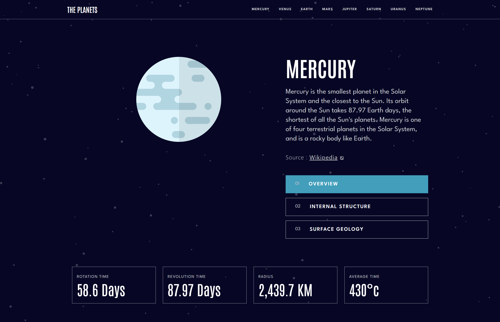

# Frontend Mentor - Planets fact site solution

This is a solution to the [Planets fact site challenge on Frontend Mentor](https://www.frontendmentor.io/challenges/planets-fact-site-gazqN8w_f). Frontend Mentor challenges help you improve your coding skills by building realistic projects.

## Table of contents

- [Overview](#overview)
  - [The challenge](#the-challenge)
  - [Screenshot](#screenshot)
  - [Links](#links)
- [My process](#my-process)
  - [Built with](#built-with)
  - [What I learned](#what-i-learned)
- [Author](#author)

## Overview

### The challenge

Users should be able to:

- View the optimal layout for the app depending on their device's screen size
- See hover states for all interactive elements on the page
- View each planet page and toggle between "Overview", "Internal Structure", and "Surface Geology"

### Screenshot



### Links

- Solution URL: [https://github.com/KH-Ray/planets-fact-site](https://github.com/KH-Ray/planets-fact-site)
- Live Site URL: [https://planets-fact-site-lemon.vercel.app/mercury](https://planets-fact-site-lemon.vercel.app/mercury)

## My process

### Built with

- Semantic HTML5 markup
- Flexbox
- CSS Grid
- [React](https://reactjs.org/) - JS library
- [Next.js](https://nextjs.org/) - React framework
- [TailwindCSS](https://tailwindcss.com/) - A utility-first CSS framework

### What I learned

```jsx
export default function PlanetPage({ params: { slug } }) {
  const [currentView, setCurrentView] = useState("overview");
  const [currentPlanet, setCurrentPlanet] = useState(null);

  useEffect(() => {
    getPlanets()
      .then((planets) => {
        const filteredPlanets = planets.filter(
          (planet) => slug === planet.name.toLowerCase(),
        );

        setCurrentPlanet(...filteredPlanets);
      })
      .catch((err) => console.error(err));
  }, []);

  if (!currentPlanet) {
    return (
      <main className="flex items-center justify-center">
        <div className="lds-ring mt-36">
          <div></div>
          <div></div>
          <div></div>
          <div></div>
        </div>
      </main>
    );
  }

  return (
    <main>
      <section>
        <div className="mx-auto max-w-7xl px-8">
          <div className="mb-24 grid gap-y-24 md:grid-cols-1 lg:grid-cols-[60fr_40fr]">
            <div className="relative flex flex-col items-center">
              

              
            </div>

            <div className="flex flex-col gap-12 md:flex-row lg:flex-col">
              <div className="flex basis-full flex-col gap-8 text-center md:text-left lg:basis-0">
                <h2 className="font-antonio text-4xl font-semibold uppercase md:text-5xl lg:text-7xl">
                  {currentPlanet.name}
                </h2>
                <p className="font-spartan text-light-gray md:text-xl lg:text-2xl">
                  {currentView === "overview"
                    ? currentPlanet.overview?.content
                    : currentView === "internal structure"
                      ? currentPlanet.structure.content
                      : currentPlanet.geology.content}
                </p>
                <div className="text-base tracking-wider text-light-gray md:text-lg lg:text-xl">
                  <span className="font-light">Source :</span>{" "}
                  <a
                    href={
                      currentView === "overview"
                        ? currentPlanet.overview?.source
                        : currentView === "internal structure"
                          ? currentPlanet.structure.source
                          : currentPlanet.geology.source
                    }
                    className="underline"
                    target="_blank"
                  >
                    Wikipedia
                  </a>
                  <Image src="/assets/icon-source.svg" alt="wikipedia link icon" className="ml-2 inline-block" width={12} height={12} />
                </div>
              </div>

              <div className="flex w-full flex-col gap-4">
                <ViewButton
                  currentView={currentView}
                  setCurrentView={setCurrentView}
                  title="overview"
                  number="01"
                  planet={currentPlanet.name}
                />
                <ViewButton
                  currentView={currentView}
                  setCurrentView={setCurrentView}
                  title="internal structure"
                  number="02"
                  planet={currentPlanet.name}
                />
                <ViewButton
                  currentView={currentView}
                  setCurrentView={setCurrentView}
                  title="surface geology"
                  number="03"
                  planet={currentPlanet.name}
                />
              </div>
            </div>
          </div>

          <div className="flex flex-col gap-4 pb-16 font-antonio md:flex-row lg:gap-6">
            <FactsCard title="ROTATION TIME" data={currentPlanet.rotation} />
            <FactsCard
              title="REVOLUTION TIME"
              data={currentPlanet.revolution}
            />
            <FactsCard title="RADIUS" data={currentPlanet.radius} />
            <FactsCard title="AVERAGE TIME" data={currentPlanet.temperature} />
          </div>
        </div>
      </section>
    </main>
  );
}
```

## Author

- Website - [Khanza Arrayyan](https://khray-portfolio.netlify.app/)
- Frontend Mentor - [@KH-Ray](https://www.frontendmentor.io/profile/KH-Ray)
